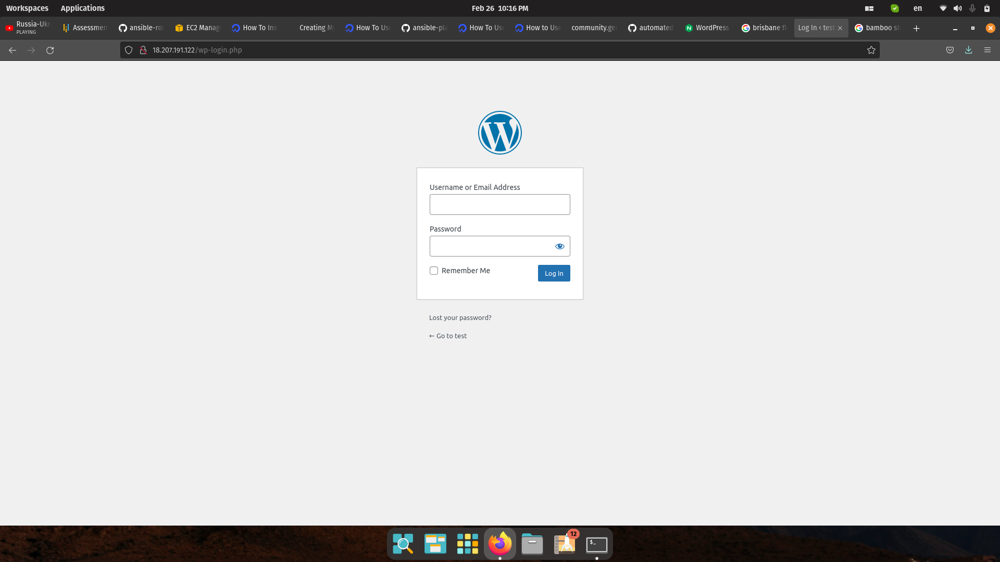
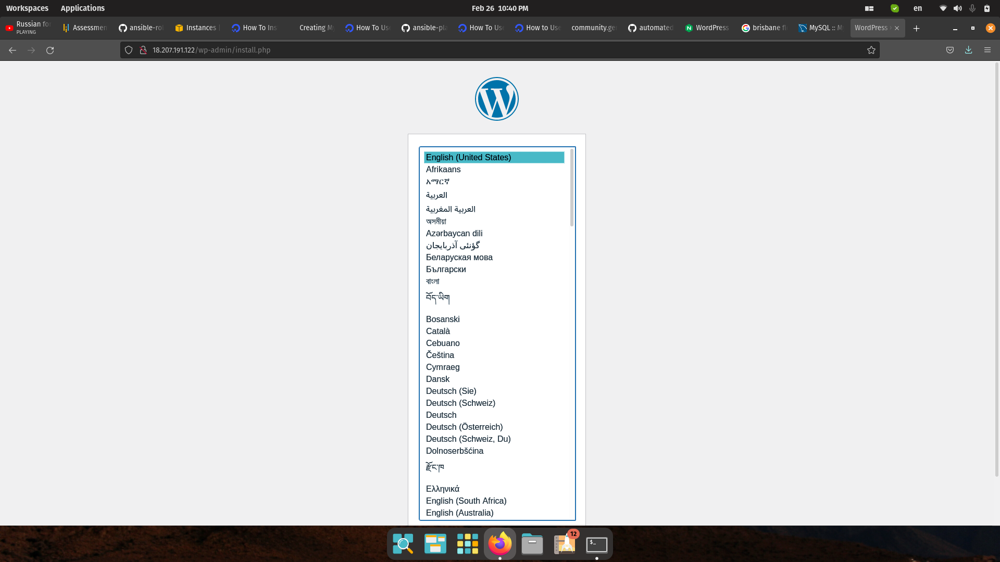

# Wordpress Ansible Configuration

This playbook will install a WordPress website on top of a LAMP environment (**L**inux, **A**pache, **M**ySQL and **P**HP) on an Ubuntu 18/20.04 machine. This code is mostly extracted from here [How to Use Ansible to Set Up Wordpress on Ubuntu 18.04 LAMP](https://www.digitalocean.com/community/tutorials/how-to-use-ansible-to-install-and-set-up-wordpress-with-lamp-on-ubuntu-18-04). However the playbook there is written as one playbook. For better portability this work has broken the Apache, Mysql and PHP components are broken out into individual roles. Each role is a minimal and default configuration for each component.


## Structure

There are two playbooks, the main playbook is playbook.yml which installs the LAMP components and Wordpress and a setup playbook that takes care of the ssh setup for Ansible communication. Common variablesthat are global to all playbooks are in group_vars/all.yml. Otherwise, the structure of the project is typical of a role based playbook Ansible project. Below shows the directory structure of the project. 

```
├── group_vars
│   └── all.yml
├── inventory
├── playbook.yml
├── readme.md
├── roles
│   ├── apache
│   │   ├── files
│   │   ├── handlers
│   │   │   └── main.yml
│   │   ├── tasks
│   │   │   └── main.yml
│   │   ├── templates
│   │   │   └── apache.conf.j2
│   │   └── vars
│   │       └── main.yml
│   ├── common
│   │   └── tasks
│   │       └── main.yml
│   ├── mysql
│   │   ├── files
│   │   ├── handles
│   │   ├── tasks
│   │   │   └── main.yml
│   │   ├── templates
│   │   └── vars
│   │       └── main.yml
│   ├── php
│   │   ├── files
│   │   ├── handles
│   │   ├── tasks
│   │   │   └── main.yml
│   │   ├── templates
│   │   └── vars
│   │       └── main.yml
│   └── wordpress
│       ├── files
│       ├── handles
│       ├── tasks
│       │   └── main.yml
│       ├── templates
│       │   └── wp-config.php.j2
│       └── vars
└── setup.yml
```

## Setup

Firstly download the source code here [github link](https://github.com/lyanhminh/ansible-wordpress). As Ansible uses ssh to communicate with the remote worker node, copy the public ssh key you'll be using into ~/.ssh/authorized_keys and afterwards, make sure you can ssh into the instance with the ssh key. 

#### Configuration

 There are a few variables to be defined in group_vars/all.yml before playbook.yml can be run. Namely the `create_user` variable will create the user that Ansible will ssh into the instance as. Also `http_host` must be set for the Apache hostname configuration variable. It is in all.yml as the sql role also references it.

```
# SSH Setup
create_user: devops  
copy_local_key: "{{ lookup('file', lookup('env','HOME') + '/.ssh/id_rsa.pub') }}"
sys_packages: [ 'curl', 'vim', 'git', 'ufw', 'jq']

# For Apache
http_host: localhost
```

The remaining variables are found in the vars files within each role.                         

- `php_modules`:  An array containing PHP extensions that should be installed to support your WordPress setup. You don't need to change this variable but can modify it as you desire. As a default, it includes:
php_modules: [ 'php-curl', 'php-gd', 'php-mbstring', 'php-xml', 'php-xmlrpc', 'php-soap', 'php-intl', 'php-zip' ]
- `mysql_root_password`: The desired password for the **root** MySQL account.
- `mysql_db`: The name of the MySQL database that should be created for WordPress.
- `mysql_user`: The name of the MySQL user that should be created for WordPress.
- `mysql_password`: The password for the new MySQL user.
- `http_host`: Your domain name.
- `http_conf`: The name of the configuration file that will be created within Apache.
- `http_port`: HTTP port for this virtual host, where `80` is the default. 


###  Run the Playbook

```command
ansible-playbook-i hosts -u [remote user set in group_vars/all.yml] playbook.yml --private-key=~/.ssh/[ssh key used to set up Ansible] -u [user name in group_vars/all.yml]
```

When the playbook finishes running navigate to `http://< IP >. You should see the setup page for Wordpress.  

###  Take-aways and Further Steps
The role-based playbook and having the group variables structure allows logical separation of the configuration process and a simple easy to understand main playbook. However this playbook assumes a bit restrictively that the remote server is an 18.04+ Ubuntu OS. Conditional checks can be incorporated with different variable and template files to generalize to different Linus distributions and versions.
